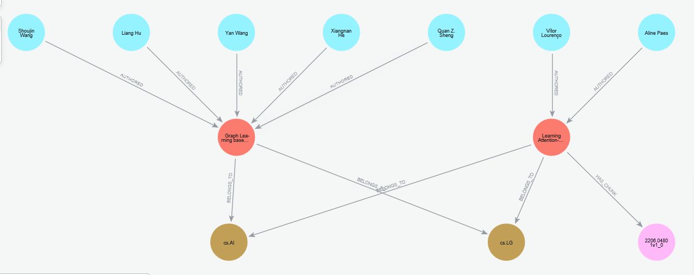

# Virtual-Research-Assistant
A virtual research assistant that helps explore computer science literature using GraphRAG and AI Agents.

## Motivation
Conducting a literature review in computer science is time-consuming. Researchers must continuously:
- search for relevant papers
- read and compare methods
- track relationships between works
- stay updated with newly published papers

Therefore, there is a strong need for automated tools that can accelerate literature exploration.

### LLM + Retrieval-Augmented Generation (RAG)
Large Language Models (LLMs) provide powerful capabilities for summarizing and synthesizing information. However, LLMs alone suffer from hallucinated facts, outdated knowledge, and lack of access to new research. Retrieval-Augmented Generation (RAG) addresses this problem by retrieving relevant documents and providing them as context to the model. This approach significantly improves factual accuracy and enables the system to work with external knowledge sources.

Traditional RAG systems typically rely on keyword or sematic search over document chunks. While effective for retrieving relevant text, they have several limitations:
- documents are treated as independent pieces of text
- relationships between papers are ignored (papers written by same authors or inspired by the same method).
- difficult to analyze research directions and overall insights.

### Why GraphRAG?
GraphRAG extends traditional RAG by combining vector retrieval with a knowledge graph. Instead of storing papers as isolated documents, the system models relationships such as:
```
Author → Paper
Paper → Category
Paper → Citation
Paper → Text Chunks
```
This enables the system to:
- retrieve relevant text using vector similarity
- explore relationships through graph traversal
- analyze research trends and connections

### Why AI Agents?
Even with multiple retrieval strategies available (vector search, keyword search, graph queries), choosing the correct retrieval method for each query can be difficult.

AI Agents provide a solution by enabling the system to:
- dynamically select the most appropriate retrieval tool
- combine multiple tools when necessary
- perform multi-step reasoning during research exploration

## Operation Flow
The system follows a GraphRAG + Agentic Retrieval architecture.
```
User Query
     ↓
AI Agent
     ↓
Tool Selection
 ├── Vector Search 
 ├── Keyword Search 
 ├── Graph Query/Traversal
 └── ArXiv Paper Crawling and Ingestion
     ↓
Neo4j Graph + Vector Index
     ↓
Relevant Context
     ↓
LLM generates literature review
```

## Graph Database Schema
- Nodes: 
  - Paper: Represents a research paper.
  - Author: Represents paper authors.
  - Category: Represents research fields.
  - Chunk: Text segments extracted from paper content.
- Relationship:
```
(:Author)-[:AUTHORED]->(:Paper)

(:Paper)-[:BELONGS_TO]->(:Category)

(:Paper)-[:HAS_CHUNK]->(:Chunk)

(:Chunk)-[:NEXT_CHUNK]->(:Chunk)
```

## Implemented Features
Paper Ingestion Pipeline
```
ArXiv API
   ↓
Download paper text and metadata
   ↓
Create Paper nodes
   ↓
Create Author and Category nodes and relationships
   ↓
Chunk paper text
   ↓
Generate embeddings
   ↓
Store Chunk nodes
```

Example of Neo4j database:
